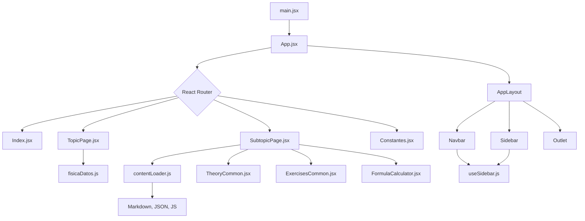

# Análisis del Proyecto: Phyxio Calculator

## 1. Introducción

Este documento ofrece un análisis exhaustivo del proyecto Phyxio Calculator, una aplicación web interactiva para aprender y practicar conceptos de física. El análisis se centra en la estructura del código fuente, la funcionalidad de cada archivo y las relaciones entre ellos.

## 2. Estructura del Proyecto

El proyecto está construido con React y Vite, y sigue una estructura de carpetas modular y organizada:

```
frontend/
├── src/
│   ├── assets/         # Imágenes y recursos estáticos
│   ├── components/     # Componentes reutilizables de React
│   ├── contexts/       # Contextos de React (ej. ThemeProvider)
│   ├── data/           # Datos de la aplicación (JSON, JS, Markdown)
│   ├── hooks/          # Hooks personalizados de React
│   ├── pages/          # Componentes de página completos
│   ├── styles/         # Archivos de estilos (CSS)
│   ├── utils/          # Funciones de utilidad
│   ├── App.jsx         # Componente raíz de la aplicación
│   └── main.jsx        # Punto de entrada de la aplicación
└── package.json        # Dependencias y scripts del proyecto
```

## 3. Diagrama de Relaciones entre Archivos

El siguiente diagrama ilustra el flujo de datos y la relación entre los componentes principales de la aplicación, desde el punto de entrada (`main.jsx`) hasta la representación de las páginas de contenido.



## 4. Descripción Detallada de Archivos

### 4.1. Punto de Entrada

*   **`main.jsx`**: Es el punto de partida de la aplicación.
    *   **Función**: Renderiza el componente `App` en el DOM.
    *   **Relaciones**: Importa `App.jsx` y los estilos globales de la aplicación.
    *   **Frameworks**: Utiliza `React` y `ReactDOM`.

### 4.2. Componente Raíz

*   **`App.jsx`**: Define la estructura principal de la aplicación.
    *   **Función**:
        *   Configura las rutas de la aplicación con `react-router-dom`.
        *   Implementa el layout principal (`AppLayout`) que contiene la barra de navegación y la barra lateral.
        *   Utiliza `Outlet` de React Router para renderizar el componente de página correspondiente a la ruta actual.
    *   **Relaciones**:
        *   Importa componentes de `pages/` y `components/`.
        *   Utiliza `ThemeProvider` para gestionar los temas de la aplicación.

### 4.3. Páginas (Screens)

Los componentes de página son responsables de renderizar el contenido principal para cada ruta.

*   **`pages/Index.jsx`**: Página de inicio.
    *   **Función**: Muestra la página principal de la aplicación, con una introducción a las diferentes ramas de la física.
    *   **Relaciones**: Consume datos de `fisicaDatos.js` para mostrar las tarjetas de los temas.

*   **`pages/TopicPage.jsx`**: Página de un tema de física.
    *   **Función**: Muestra los subtemas de un tema específico.
    *   **Relaciones**: Utiliza el `topicId` de la URL para obtener y mostrar los subtemas correspondientes desde `fisicaDatos.js`.

*   **`pages/SubtopicPage.jsx`**: Página de un subtema específico.
    *   **Función**: Es la página principal de contenido. Muestra la teoría, los ejercicios y las calculadoras de un subtema.
    *   **Relaciones**:
        *   Utiliza `contentLoader.js` para cargar dinámicamente el contenido del subtema (teoría en Markdown, ejercicios en JSON y calculadoras en JS).
        *   Renderiza los componentes `TheoryCommon`, `ExercisesCommon` y `FormulaCalculator` para mostrar el contenido cargado.

*   **`pages/Constantes.jsx`**: Página de constantes físicas.
    *   **Función**: Muestra una tabla con constantes físicas fundamentales, permitiendo filtrar y buscar.
    *   **Relaciones**: Es una página estática con contenido propio.

### 4.4. Componentes Reutilizables

*   **`components/NavbarSidebar.jsx`**:
    *   **Función**: Define los componentes `Navbar` (barra de navegación superior) y `Sidebar` (barra lateral).
    *   **Relaciones**: `Navbar` contiene el botón para expandir/contraer la `Sidebar`, cuya lógica se gestiona a través del hook `useSidebar`.

*   **`components/Layout.jsx` y `SubtopicLayout.jsx`**:
    *   **Función**: Definen la estructura visual de las páginas, integrando `Navbar` y `Sidebar`. `SubtopicLayout` es específico para las páginas de subtemas y podría tener una estructura ligeramente diferente.
    *   **Relaciones**: Utilizan el hook `useSidebar` para controlar el estado de la barra lateral.

*   **`components/FormulaCalculator.jsx`**:
    *   **Función**: Renderiza una calculadora interactiva para una fórmula específica.
    *   **Relaciones**: Recibe como props la configuración de la calculadora (parámetros, fórmula, etc.) que se carga desde los archivos de datos.

*   **`components/TheoryCommon.jsx` y `ExercisesCommon.jsx`**:
    *   **Función**: Renderizan la teoría (desde Markdown) y los ejercicios (desde JSON), respectivamente.
    *   **Relaciones**: Utilizan el componente `MarkdownRenderer` para mostrar el contenido Markdown con formato.

### 4.5. Datos y Lógica de Negocio

*   **`data/`**: Esta carpeta es el "cerebro" de la aplicación. Contiene toda la información de física en formatos estructurados:
    *   **`fisicaDatos.js`**: Define la jerarquía de temas y subtemas.
    *   **Archivos `.md`**: Contienen la teoría de cada subtema en formato Markdown.
    *   **Archivos `.json`**: Contienen los ejercicios de cada subtema.
    *   **Archivos `.js` (calculators)**: Definen la lógica y los parámetros de las calculadoras de cada subtema.

*   **`hooks/useSidebar.js`**:
    *   **Función**: Hook personalizado de React que gestiona el estado de la barra lateral (expandida/contraída).

*   **`utils/contentLoader.js`**:
    *   **Función**: Utilidad clave para cargar dinámicamente el contenido de los subtemas (teoría, ejercicios, calculadoras) bajo demanda, utilizando importaciones dinámicas de Vite.
    *   **Relaciones**: Es utilizado por `SubtopicPage.jsx` para obtener el contenido del subtema actual.

## 5. Conclusión

Phyxio Calculator es una aplicación bien estructurada que separa eficazmente la presentación, los datos y la lógica. El uso de importaciones dinámicas para cargar el contenido de los subtemas es una decisión de diseño inteligente que mejora el rendimiento de la aplicación, ya que solo se carga el contenido que el usuario necesita en cada momento.

El núcleo de la aplicación reside en la carpeta `data/`, que contiene toda la información de física. Esto facilita la ampliación de la aplicación con nuevos temas y subtemas sin necesidad de modificar el código de los componentes principales.
